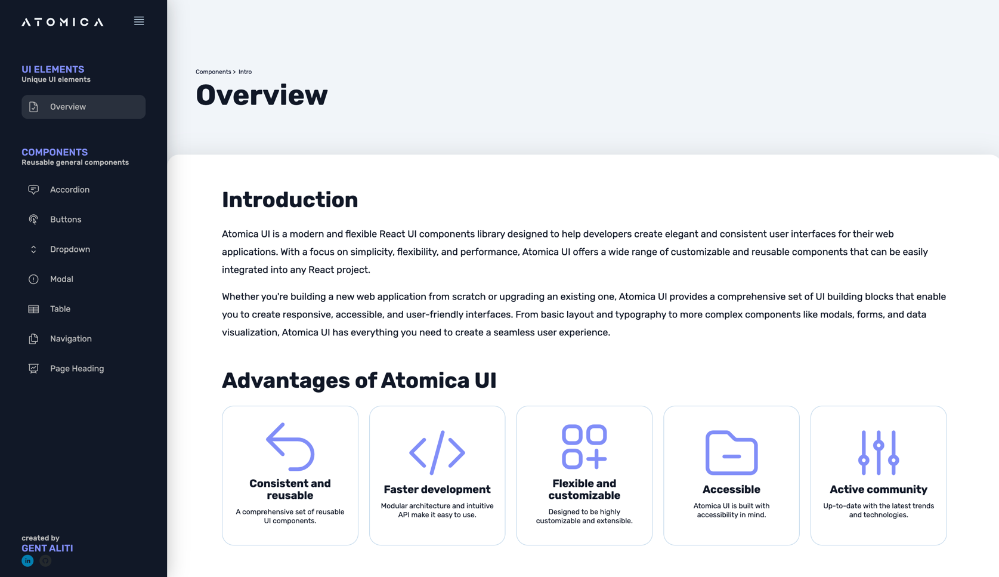

# Atomica UI

## Overview

Atomica UI is a React UI Theme that provides a set of reusable components for building user interfaces. 
This library was created for personal use.

## Docs Dashboard UI

You can find the docs dashboard in this url: https://gentaliti.github.io/react-toolkit/

## Installation

## Usage

## Available Components

Atomica UI provides a range of customizable components, including:

- Button
- Accordion
- Dropdown
- Modal
- Table
- Pagination
- More components coming soon

For detailed documentation on each component, please see the official [Atomica UI documentation](https://gentaliti.github.io/react-toolkit/).

## Contributing

While Atomica UI was originally created for personal use, contributions and feedback from the community are always welcome. 
If you find a bug or have a feature request, please open an issue on the repository.
